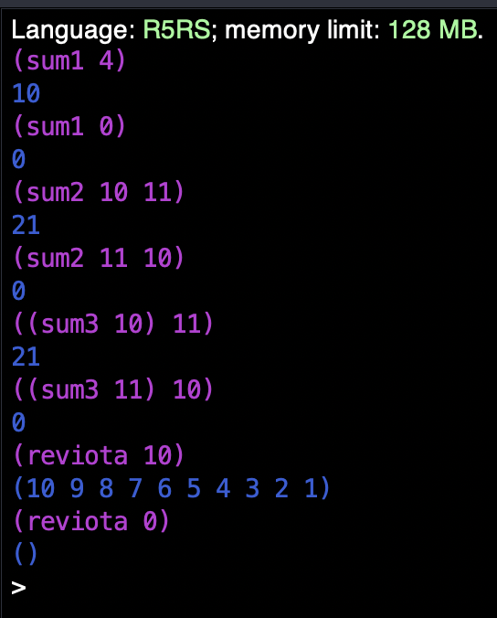

#### 1.
Skrifið halaendurkvæmt Scheme fall sum1 sem uppfyllir eftirfarandi lýsingu.
```
;; Notkun: (sum1 n)
;; Fyrir: n er heiltala, n>=0
;; Gildi: Summan 0+1+...+n
;; Use: (sum1 n)
;; Pre: n is an integer, n>=0
;; Value: The sum 0+1+...+n

(define (sum1 n)
  (define  (hjalp-sum1 n x)
    (if (= n 0)
      x
      (hjalp-sum1 (- n 1) (+ n x) )
    )
  )
  (hjalp-sum1 n 0)
)

(display "(sum1 4)") (newline)
(sum1 4)

(display "(sum1 0)") (newline)
(sum1 0)
```

<div style="page-break-after: always;"></div>

#### 2.
Skrifið halaendurkvæmt Scheme fall sum2 sem uppfyllir eftirfarandi lýsingu.
```
;; Notkun: (sum2 i n)
;; Fyrir:  i og n eru heiltölur, i <= n+1
;; Gildi:  Summan i+(i+1)+...+n, summa þeirra
;;         heiltalna k þannig að i <= k <= n.
;; Use:    (sum2 i n)
;; Pre:    i and n are integers, i <= n+1
;; Value:  The sum i+(i+1)+...+n, the sum of the
;;         integers k such that i <= k <= n.

(define (sum2 i n)
  (define (hjalp-sum2 i n k)
    (if (< n i)
      k
      (hjalp-sum2 (+ i 1) n (+ i k))
    )
  )
  (hjalp-sum2 i n 0)
)

(display "(sum2 10 11)") (newline)
(sum2 10 11)
(display "(sum2 11 10)") (newline)
(sum2 11 10)
```

<div style="page-break-after: always;"></div>

#### 3.
Skrifið Scheme fall sum3 sem uppfyllir eftirfarandi lýsingu.
```
;; Notkun: ((sum3 i) n)
;; Fyrir:  i og n eru heiltölur, i <= n+1
;; Gildi:  Summan i+(i+1)+...+n
;; Use:   ((sum3 i) n)
;; Pre:   i and n are integers, i <= n+1
;; Value: The sum i+(i+1)+...+n

(define ((sum3 i) n)
  (let loop ((i i) (n n) (k 0))
    (if (< n i)
    k
    (loop (+ i 1) n (+ i k))
    )
  )
)

(display "((sum3 10) 11)") (newline)
((sum3 10) 11)
(display "((sum3 11) 10)") (newline)
((sum3 11) 10)
```

<div style="page-break-after: always;"></div>

#### 4.
Skrifið halaendurkvæmt fall reviota, ásamt lýsingu, sem tekur heiltölu n ≥ 0 sem viðfang og skilar listanum (n . . . 3 2 1). Þið munuð þurfa halaendurkvæmt hjálparfall, svipað og í myiota að ofan. Athugið að hjálparfall sem er faldað inn í annað fall getur notað breytur (viðföng) úr ytra fallinu. Þið þurfið að skrifa lýsingu (Notkun/Fyrir/Gildi) bæði fyrir reviota og fyrir hjálparfallið.

```
;; Notkun: (reviota n)
;; Fyrir: n er heiltala, n>=0
;; Gildi: Listi heiltalna i þannig að 
;; 0 < i <= n, í lækkandi röð.
(define (reviota n)
  ;; Notkun: (hjalp r)
  ;; Fyrir: r er heiltala, r >= 0.
  ;; Gildi:  Summan (n . . . 3 2 1)
  (define (hjalp r)
(if (= r 0) '()
      (cons r (hjalp (- r 1)))
    )
)
(hjalp n)
)
(display "(reviota 10)") (newline)
(reviota 10)
(display "(reviota 0)") (newline)
(reviota 0)
```

<div style="page-break-after: always;"></div>

# Úttak

