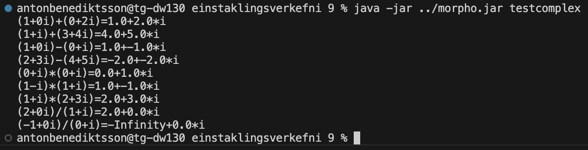

# TÖL304G Forritunarmál Verkefnablað 9

## Einstaklingsverkefni 9



```
{;;;

Design document for "complex.mmod"
==================================

Exported
--------

Use:  z = complex(x,y);
Pre:  x and y are floating point numbers.
Post: z is the complex number x+yi.

Use:  x = real(z);
Pre:  z is a complex number.
Post: x is the real number of z.

Use:  x = imag(z);
Pre:  z is a complex number.
Post: x is the imaginary number of z.

Use:  z = x+++y;
Pre:  x and y are complex numbers.
Post: z is the sum of the complex numbers x and y.

Use:  z = x---y;
Pre:  x and y are complex numbers.
Post: z is the difference of the complex numbers x and y.

Use:  z = x***y;
Pre:  x and y are complex numbers.
Post: z is the product of the complex numbers x and y.

Use:  z = x///y;
Pre:  x and y are complex numbers.
      y is not zero.
Post: z is the quotient of the complex numbers x and y.

Imported
--------

Only BASIS function are imported.

;;;}

"complex.mmod" =
{{
;;; Data invariant:
;;;   A complex number z = x+yi, where x and y
;;;   are double numbers, is represented as a pair.

+++ =
	fun(x,y)
	{
		var new_real = head(x) + head(y);
		var new_imag = tail(x) + tail(y);
		return(new_real : new_imag);
	};

--- =
	fun(x,y)
	{
		var new_real = head(x) - head(y);
		var new_imag = tail(x) - tail(y);
		return(new_real : new_imag);
	};

*** =
	fun(x,y)
	{
		var new_real = head(x) * head(y);
		var new_imag = tail(x) * tail(y);
		return(new_real : new_imag);
	};


/// =
	fun(x,y)
	{
		var new_real = head(x) / head(y);
		var new_imag = tail(x) / tail(y);
		return(new_real : new_imag);
	};

complex =
	fun(x,y)
	{
		var z = x : y;
	};

real =
	fun(z)
	{
		return(head(z));
	};

imag =
	fun(z)
	{
		return(tail(z));
	};
}}
;

"testcomplex.mexe" = main in
!
{{
main =
	fun()
	{
		writeln("(1+0i)+(0+2i)="++show(complex(1.0,0.0)+++complex(0.0,2.0)));
		writeln("(1+i)+(3+4i)="++show(complex(1.0,1.0)+++complex(3.0,4.0)));
		writeln("(1+0i)-(0+i)="++show(complex(1.0,0.0)---complex(0.0,1.0)));
		writeln("(2+3i)-(4+5i)="++show(complex(2.0,3.0)---complex(4.0,5.0)));
		writeln("(0+i)*(0+i)="++show(complex(0.0,1.0)***complex(0.0,1.0)));
		writeln("(1-i)*(1+i)="++show(complex(1.0,-1.0)***complex(1.0,1.0)));
		writeln("(1+i)*(2+3i)="++show(complex(1.0,1.0)***complex(2.0,3.0)));
		writeln("(2+0i)/(1+i)="++show(complex(2.0,0.0)///complex(1.0,1.0)));
		writeln("(-1+0i)/(0+i)="++show(complex(-1.0,0.0)///complex(0.0,1.0)));
	};
	
;;; Use:  s = show(z);
;;; Pre:  z is a complex number.
;;; Post: s is a string of format x+y*i
;;;       where x is the real part of z
;;;       and y is the imaginary part of
;;;       z.
show =
	fun(z)
	{
		real(z)++"+"++imag(z)++"*i"
	};
}}
*
"complex.mmod"
*
BASIS
;
```