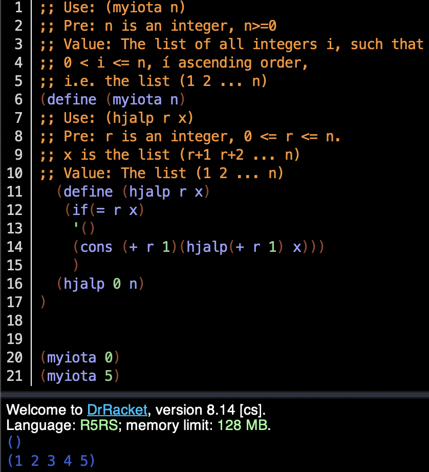
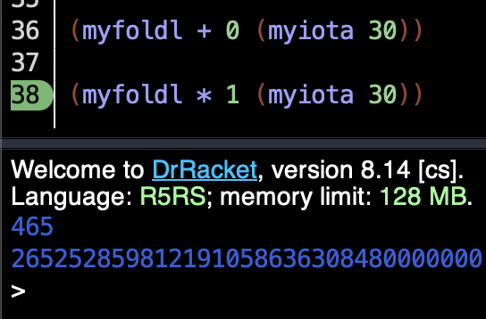

# TÖL304G Forritunarmál Verkefnablað 4


1. Klárið að forrita halaendurkvæmt Scheme fall myiota miðað við eftirfarandi
beinagrind. Athugið að faldaða fallið hjalp þarf að vera halaendurkvæmt.

```
;; Use: (myiota n)
;; Pre: n is an integer, n>=0
;; Value: The list of all integers i, such that
;; 0 < i <= n, í ascending order,
;; i.e. the list (1 2 ... n)
(define (myiota n)
;; Use: (hjalp r x)
;; Pre: r is an integer, 0 <= r <= n.
;; x is the list (r+1 r+2 ... n)
;; Value: The list (1 2 ... n)
  (define (hjalp r x)
   (if(= r x)
    '()
    (cons (+ r 1)(hjalp(+ r 1) x)))
    )
  (hjalp 0 n)
)
```



2. Skrifið halaendurkvæmt Scheme fall myfoldl sem uppfyllir eftirfarandi lýs-
ingu.


```
;; Use: (myfoldl f u x)
;; Pre: f is a binary funtion, i.e. a function
;;      that takes two arguments of some type,
;;      x=(x1 ... xN) is a list of values of
;;      that type, u is a value of that type.
;; Value: (f (f ...(f (f u x1) x2) ...) xN)
;; Note: In other words, if we define a binary
;;       operation ! with a!b = (f a b), then
;;       then the value returned is the value of
;;       u ! x1 ! x2 | ... ! xN
;;       where we compute from left to right
(define(myfoldl f u x)
  (if(null? x)
     u
  (myfoldl f (f u (car x)) (cdr x)))
 )
```

Notið föllin að ofan (myiota og myfoldl) til að skrifa tvær Scheme segðir
til að reikna summu og margfeldi talnanna 1, . . . , 30.

```
(myfoldl + 0 (myiota 30))

(myfoldl * 1 (myiota 30))
```


