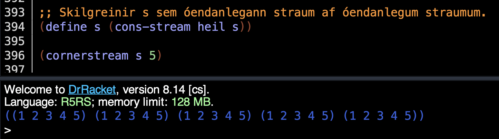
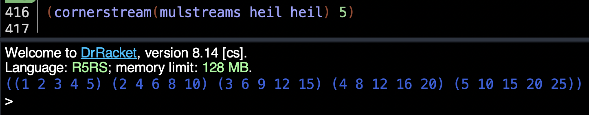

# TÖL304G Forritunarmál Verkefnablað 5

###  Hópverkefni 5
---

#### 1.
```
;; Use: (modpow p q r)
;; Pre: p,q and r are integers, q >= 0, 0 <= p < r and r > 1
;; Value: The remainder when r is divided into p to the power q
(define (modpow p q r)
  ;; Use: (help n acc total)
  ;; Pre: n, acc, and total are integers, acc >= 0
  ;; Value: The remainder when r is divided into n raised to the power 
  ;;        of acc, accumulated with the current total
  (define (help n acc total)
    (if (= acc 0)
        (remainder total r)
        (if (= 0 (remainder acc 2))
            (help (remainder (* n n) r) (/ acc 2) total)
            (help n (- acc 1) (remainder (* total n) r)))))
  (help p q 1))

(modpow 123 1234567890 12345678901)
(modpow 2 10 10000)

```


<div style="page-break-after: always;"></div>

### 2.

```
;; Notkun: (cornerstream s n)
;; Fyrir: s er óendanlegur straumur óendanlegra
;; strauma,
;; s=[[x11 x12 ...],[x21 x22 ...] ...].
;; n er heiltala, n>=0.
;; Gildi: Listinn
;; ((x11 x12 ... x1n)
;; (x21 x22 ... x2n)
;; ...
;; (xn1 xn2 ... xnn)
;; )
(define (cornerstream s n)
  (stream-list (stream-map (lambda (x) (stream-list x n)) s)
               n)
)

;; Skilgreinir s sem óendanlegann straum af óendanlegum straumum.
(define s (cons-stream heil s))

(cornerstream s 5)

```


<div style="page-break-after: always;"></div>

### 3.

```
;; Notkun: (mulstreams x y)
;; Fyrir: x og y eru óendanlegir straumar talna,
;; x=[x1 x2 x3 ...].
;; y=[y1 y2 y3 ...].
;; Gildi: Óendanlegur straumur óendanlegra strauma
;; talna sem er
;; [[x1*y1 x2*y1 x3*y1 ...]
;; [x1*y2 x2*y2 x3*y2 ...]
;; [x1*y3 x2*y3 x3*y3 ...]
;; .
;; .
;; .
;; ]
(define (mulstreams x y)
  (stream-map (lambda (a) (stream-map (lambda (b) (* b a)) x)
  )y
 ))

(cornerstream(mulstreams heil heil) 5)
```


<div style="page-break-after: always;"></div>

### 4.

```
;; Use: (powerlist n)
;; Pre: n is an integer, n>=0.
;; Value: The list (y1 y2 y3 ...)
;; that contains all lists that can be
;; constructed by taking zero or more
;; values from {1,...,n}
;; and concatenating them in a list in
;; descending order.
(define (powerlist n)
  (if (= n 0)
      '(())
      (let ((previous (powerlist (- n 1))))
        (append previous
                (map (lambda (x) (cons n x)) previous)))))


(powerlist 0)
(powerlist 1)
(powerlist 2)
(powerlist 3)
```
