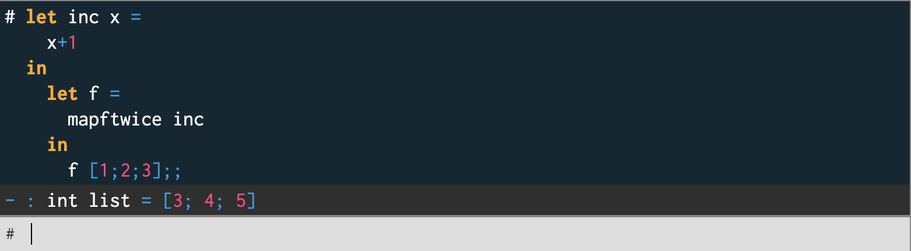

# TÖL304G Forritunarmál Verkefnablað 6

### Hópverkefni

#### 1. Skrifið fall mapreduce í CAML
þar sem kallið mapreduce f op u x tekur fall f, tvíundaraðgerð op, gildi u og lista x = [x1; ...; xn] og skilar gildinu u ⊕f (x1) ⊕ . . . ⊕f (xn), þar sem x ⊕y = (op x y). Fallið skal vera halaendurkvæmt og skal reikna frá vinstri til hægri.

---


---

```
(*
** Usage:  myfoldl f u x
** Pre:    f is a binary funtion, i.e. a function
**         that takes two arguments of some type,
**         x=(x1 ... xN) is a list of values of 
**         that type, u is a value of that type.
** Value:  (f (f ...(f (f u x1) x2) ...) xN)
*) 
let rec myfoldl f u x =
  match x with
  | [] -> u
  | h :: t -> myfoldl f (f u h) t
(*
** Usage:  mapreduce f op u x
** Pre:    function f, binary operation op, value u and list x = [x1; ...; xn]
** Value:  u ⊕ f(x1) ⊕ . . . ⊕ f(xn), where x ⊕ y = (op x y)
*)
let mapreduce f op u x =
  myfoldl (fun u x -> op u (f x)) u x
```

<div style="page-break-after: always;"></div>

#### 2. Skrifið fall mapftwice í CAML 
sem tekur fall sem viðfang og skilar falli sem tekur lista sem viðfang, sem aftur skilar lista þeirra gilda sem út koma þegar 1 viðfanginu í fallið mapftwice er beitt tvisvar í röð á hvert stak í listanum. Þannig að ef viðfangið er fall g þá skal beita g ◦ g á hvert stak listans. 

---



```
(*
** Usage:  mapftwice g
** Pre:    g is a unary function (i.e., takes one argument),
**         and x = [x1; ...; xn] is a list of values that g can be applied to.
** Value:  [g(g(x1)); g(g(x2)); ...; g(g(xn))]
*)
let mapftwice g =
  (*
  ** Usage:  helper g lst
  ** Pre:    g is a unary function, and lst = [x1; ...; xn] is a list of values
  **         that g can be applied to.
  ** Value:  [g(g(x1)); g(g(x2)); ...; g(g(xn))], i.e., each element in lst 
  **         is transformed by applying g twice to each element.
  *)
  let rec helper g lst =
    match lst with
    | [] -> []
    | h :: t -> (g (g h)) :: helper g t
  in
  fun x -> helper g x ;;
```