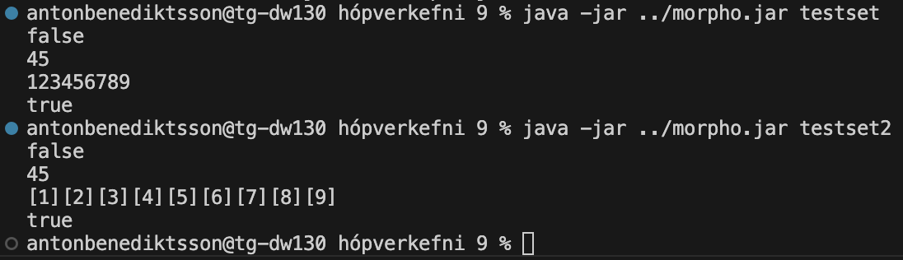

# TÖL304G Forritunarmál Verkefnablað 9



```
;;;;;;;;;;;;;;;;;;;;;;;;;;;;;;;;;;;;;;;;;;;;
;;;
;;; Design document
;;; ===============
;;;
;;; Exported
;;; --------
;;;
;;; Use:   val s = makeSet();
;;; Pre:   Nothing.
;;; Post:  s contains a new empty set of
;;;        values that are allowed as
;;;        arguments to the imported
;;;        function comp.
;;;
;;; Imported
;;; --------
;;;
;;; Use:  val c = comp(x,y);
;;; Pre:  x and y are values that are 
;;;       allowed to be stored in the sets
;;;       implemented here.
;;; Post: c is an integer that is <0 if x
;;;       must precede y, >0 if y must
;;;       precede x, and ==0 if x and y
;;;       are equal.
;;; Note: comp should define an ordering on
;;;       the values allowed in the sets.
;;;       The ordering should ensure that
;;;       any finite set of values has a
;;;       least element.
;;;
;;; Use:  s.add(x);
;;; Pre:  s is a set that can contain x.
;;; Post: x has been added to s if it was
;;;       not already in s. If x was
;;;       was already in s then s is
;;;       unchanged.
;;;
;;; Use:  val e = s.isEmpty();
;;; Pre:  s is a set.
;;; Post: e contains true if s is empty,
;;;       false otherwise.
;;;
;;; Use:  val c = s.contains(x);
;;; Pre:  s is a set that can contain x.
;;; Post: c is true if s contains x, false
;;;       otherwise.
;;;
;;; Use:  val m = s.min();
;;; Pre:  s is a set, not empty.
;;; Post: m is the minimal value in s,
;;;       according to the imported
;;;       function comp.
;;;
;;; Use:  s.remove(x);
;;; Pre:  s is a set that can contain x.
;;; Post: If s contained x then x has
;;;       been removed from s, otherwise
;;;       s is unchanged.
;;;
;;; Use:  val r = s.mapReduce(op,f,u);
;;; Pre:  s is a set.
;;;       op is a binary function,
;;;       f is a unary function.
;;;       u is some value such that
;;;       the expression in the post-
;;;       condition can be computed.
;;; Post: The expression
;;;        u ! f(x1) ! f(x2) ! ... ! f(xN)
;;;       has been computed, where x!y
;;;       is equivalent to op(x,y) and
;;;       the computation is performed
;;;       from left to right, and the
;;;       values x1,x2,...,xN are all the
;;;       values in s in ascending order.
;;;
;;;;;;;;;;;;;;;;;;;;;;;;;;;;;;;;;;;;;;;;;;;;

"set.mmod" =
{{
makeSet = fun makeSet();
}}
*
!
{{
makeSet =
	obj()
	{
		var s = [];
		;;; Data invariant:
		;;;   An empty set is denoted by the empty list s [].
		;;;   A non-empty set containing x1,x2,...xN distinct values 
		;;;   are denoted by an ordered tree containing the same values.
		;;;   See orderedtree.morpho for the definition of an ordered tree.
		msg add(x)
		{
			s = insert(s,x);
		};

		msg isEmpty()
		{
			!s
		};

		msg contains(x)
		{
			contains(s,x)
		};

		msg min()
		{
			min(s)
		};

		msg remove(x)
		{
			s = remove(s,x);
		};

		msg mapReduce(op,f,u)
		{
			var d = s;
			mapreduce(f,op,u,d);
		};
	};
	;;; Use:  val r = mapreduce(f, op, u, t)
	;;; Pre:  - op is a binary function,
	;;;       - f is a unary function,
	;;;       - u is some value,
	;;;       - t is an ordered tree.
	;;; Post: The expression `u op f(x1) op f(x2) op ... op f(xN)` 
	;;;       is computed, where the computation is done from left to right,
	;;;       and x1, x2, ..., xN are the values in `t` in ascending order.
	mapreduce = fun(f,op,u,t){
		if(t==[]){
			return u;
		}
		else {
			return mapreduce(f,op,(op(u,f(min(t)))),remove(t,min(t)));
		}
	};
}}
*
"orderedtree.mmod"
;

;;; A test program.
"testset.mexe" = main in
{{
main =
	fun()
	{
		try
		{
			var x = [1,9,2,8,3,7,4,6,5];
			val s = makeSet();	;;; A set of integers
			while( x )
			{
				;;; Loop invariant:
				;;; s contains a subset of the set {1..9}.
				;;; The list x contains exactly the rest of
				;;; the set {1..9}.

				s.remove(head(x));  ;;; Should have no effect
				s.add(head(x));
				s.add(head(x));     ;;; Should have no effect
				x = tail(x);
			};
			writeln(s.isEmpty());	;;; Should write false
			writeln(s.mapReduce(fun(x,y){x+y},fun(x){x},0));      ;;; Should write 45
			s.mapReduce(fun(x,y){[]},fun(x){write(x)},[]);        ;;; Should write 123456789
			writeln();
			while( !s.isEmpty() ) { s.remove(s.min()) };          ;;; Should empty the set
			writeln(s.isEmpty());	;;; Should write true
		}
		catch(e)
		{
			printExceptionTrace(&e)
		}
	};
}}
*
"set.mmod"
*
{{
;;; Use:  val c = comp(x,y);
;;; Pre:  x and y are integers.
;;; Post: x is <0 if x<y, =0 if x==y, >0 if x>y.
comp =
	fun(x,y)
	{
		x<y && (return -1);
		y<x && (return 1);
		0
	};
}}
*
BASIS
;

;;; Another test program.
"testset2.mexe" = main in
{{
main =
    fun()
    {
        try
        {
            var x = [[1],[9],[2],[8],[3],[7],[4],[6],[5]];
            val s = makeSet();    ;;; A set of non-empty integer lists
            while( x )
            {
                ;;; Loop invariant:
                ;;; s contains a subset of the set {[1]..[9]}.
                ;;; The list x contains exactly the rest of
                ;;; the set {[1]..[9]}.

                s.remove(head(x));  ;;; Should have no effect
                s.add(head(x));
                s.add(head(x));     ;;; Should have no effect
                x = tail(x);
            };
            writeln(s.isEmpty());    ;;; Should write false
            writeln(s.mapReduce(fun(x,y){x+y},fun(x){head(x)},0));  ;;; Should write 45
            s.mapReduce(fun(x,y){[]},fun(x){write(x)},[]);          ;;; Should write [1][2][3][4][5][6][7][8][9]
            writeln();
            while( !s.isEmpty() ) { s.remove(s.min()) };          ;;; Should empty the set
            writeln(s.isEmpty());    ;;; Should write true
        }
        catch(e)
        {
            printExceptionTrace(&e)
        }
    };
}}
*
"set.mmod"
*
{{
;;; Use:  val c = comp(x,y);
;;; Pre:  x and y are non-empty lists containing integers.
;;; Post: c is <0 if head(x)<head(y), =0 if head(x)==head(y),
;;;       >0 if head(x)>head(y).
comp =
    fun(x,y)
    {
        head(x)<head(y) && (return -1);
        head(y)<head(x) && (return 1);
        0
    };
}}
*
BASIS
;
```